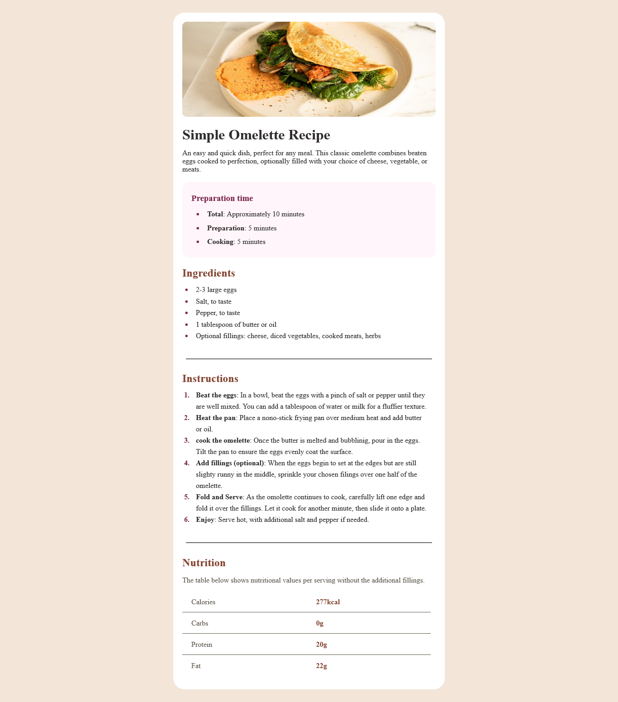

# Frontend Mentor - Recipe page solution

This is a solution to the
[Recipe page challenge on Frontend Mentor](https://www.frontendmentor.io/challenges/recipe-page-KiTsR8QQKm).

## Table of contents

- [Overview](#overview)
  - [Screenshot](#screenshot)
  - [Links](#links)
- [My process](#my-process)
  - [Built with](#built-with)
  - [What I learned](#what-i-learned)
  - [Continued development](#continued-development)
- [Author](#author)

## Overview

### Screenshot

### Links

- Solution URL: [https://github.com/elameendaiyabu/Recipe-page.git]
- Live Site URL: [https://recipe-page-project1.netlify.app/]

## My process

### Built with

- Semantic HTML5 markup
- CSS custom properties
- Flexbox

### What I learned

I learned more on styling table rows and flex boxes

### Continued development

- make site mobile responsive
- make site dynamic

## Author

- Frontend Mentor -
  [@elameendaiyabu](https://www.frontendmentor.io/profile/elameendaiyabu)
- Twitter - [@elameendk](https://www.twitter.com/elameendk)
